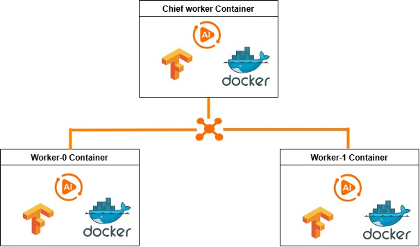
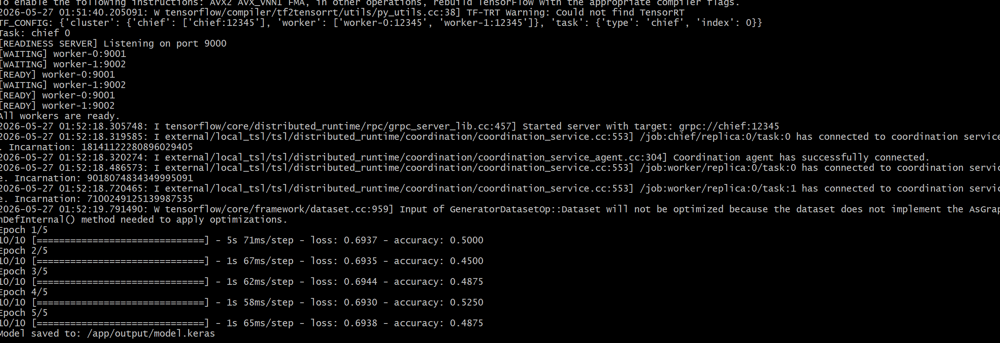

# Tensorflow with Docker container

## Introduction into Tensforflow containers 
<p>Training deep learning models can become challenging, especially when working with large datasets. Training models on a massive number of rows often requires significant time and computational resources. In many cases, powerful servers with GPUs are needed to speed up the training process. However, even with high CPU power and large memory capacity, a single machine can still face input/output (I/O) bottlenecks, in addition to the high cost of GPU hardware.</p>
<p>To address these challenges, the training process can be distributed across multiple machines. Distributed training allows the system to use a larger amount of CPU power and memory while also reducing the I/O limitations of relying on a single machine.</p>
<p>TensorFlow can be configured to run on multiple machines for distributed model training. However, managing several machines efficiently requires a platform capable of orchestrating and controlling the cluster environment. For this purpose, Kubernetes is commonly used. By containerizing TensorFlow applications and deploying them on Kubernetes, distributed deep learning training can be managed more effectively.</p>
<p>This document explains how to containerize TensorFlow applications and deploy them on Kubernetes clusters for testing and distributed training purposes.</p>

## Project goal
The main idea of this project is to show how to use docker containers to distribute the trainging process for the deep learning on different containers. These containers could be run on the same machine or different machines. In our project, we are going to implement the project on the same machine. After that we will use these dockers with Kubernetes in the second Article. Also the main goal is to use the capabilities of Tensorflow with distributed system.



In this diagram we will create three containers. 
<b>The first container</b> is cheif docker. The role for this ocntainer:
- Manage the other workers
- Share the model traing with another workers
- Collect the final training model and save it

<b> Second and third containers</b> are workers and their roles:
- Train part of model
- Save the model as temprarily
   
## Data for training
We are going small sample data. called <a href="finance_news.csv">finance_news.csv</a>

This dataset is a simple financial news sentiment dataset that can be used to train a GRU model for text classification.

Columns:

text → a short financial news headline

label → the sentiment/class of the news

Example:
1 = positive financial news

0 = negative financial news

## Build container image
To build the image we will need to build:
1- Dockerfile
<a href="Dockerfile">Dockerfile</a>

This dataset is a simple financial news sentiment dataset that can be used to train a GRU model for text classification.

2- app.py
This file is used by all kinds of workers.
Chief worker is responsible for managing the other 2 workers as well as it does the process. Also it's responsible for collect the processed model, combine them and save it

<a href="app.py">app.py</a>

3- requirements.txt

<a href="requirements.txt">requirements.txt</a>

4- model.py

We put our model SimpleRNN or CRU.

<a href="model.py">model.py</a>

5- chief.env, worker-0.env and worker-1.env

In these files, we put the configuration for Chief worker and the other two workers

<a href="chief.env">chief.env</a>
<a href="worker-0.env">worker-0.env</a>
<a href="worker-1.env">worker-1.env</a>

## Build container
```
docker build --no-cache -t finance-tf-distributed-readyness .
```
## Run the three docker containers
  ### Linux base(host is under windows with Git bash)

We will run one chief woeker and 2 workers

```
docker run -d \
--network tf-network \
--name chief \
-v "/c/alaa/tmu/project/finanace-example/readyness/model.py:/app/model.py" \
-v "/c/alaa/tmu/project/finanace-example/readyness/data:/app/data" \
-v "/c/alaa/tmu/project/finanace-example/readyness/output:/app/output" \
-p 12345:12345 \
-e BATCH_SIZE=8 \
-e EPOCHS=5 \
-e STEPS_PER_EPOCH=10 \
-e VOCAB_SIZE=5000 \
-e MAX_LEN=50 \
--env-file="C:\alaa\tmu\project\finanace-example\readyness\chief.env" \
finance-tf-distributed-readyness

docker run -d \
--network tf-network \
--name worker-0 \
-v "/c/alaa/tmu/project/finanace-example/readyness/model.py:/app/model.py" \
-v "/c/alaa/tmu/project/finanace-example/readyness/data:/app/data" \
-v "/c/alaa/tmu/project/finanace-example/readyness/output:/app/output" \
-e BATCH_SIZE=8 \
-e EPOCHS=5 \
-e STEPS_PER_EPOCH=10 \
-e VOCAB_SIZE=5000 \
-e MAX_LEN=50 \
--env-file="C:\alaa\tmu\project\finanace-example\readyness\worker-0.env" \
finance-tf-distributed-readyness

docker run -d \
--network tf-network \
--name worker-1 \
-v "/c/alaa/tmu/project/finanace-example/readyness/model.py:/app/model.py" \
-v "/c/alaa/tmu/project/finanace-example/readyness/data:/app/data" \
-v "/c/alaa/tmu/project/finanace-example/readyness/output:/app/output" \
-e BATCH_SIZE=8 \
-e EPOCHS=5 \
-e STEPS_PER_EPOCH=10 \
-e VOCAB_SIZE=5000 \
-e MAX_LEN=50 \
--env-file="C:\alaa\tmu\project\finanace-example\readyness\worker-1.env" \
finance-tf-distributed-readyness
```

## Chech the output
We have to check the logs for three dockers that we created them in the previous step

```
docker logs chief
docker logs worker-0
docker logs worker-1
```

